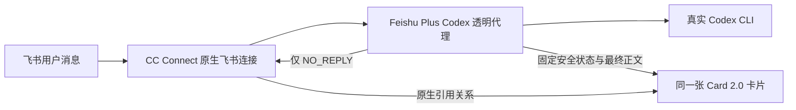

# CC Connect Feishu Plus

一个独立安装的 npm companion plugin，为 CC Connect 的 Codex 飞书入口提供自动、隐私安全的单卡片体验。

它不是 CC Connect 的 fork，也不使用 MCP。CC Connect 继续负责飞书入站、权限规则、会话路由和引用回复；插件通过 CC Connect 已支持的 Agent `cmd` 配置运行一个透明 Codex 进程代理，并用自己的 Card 2.0 卡片接管本回合的展示。

> 当前版本：`0.2.1`。支持 CC Connect `1.4.1+` 的 Codex `exec` 后端。

## 交互效果

- 收到消息后立即建立一张引用原始提问的状态卡片，不再长时间无反馈。
- 推理阶段显示 `正在思考…`，执行工具时显示 `正在调用工具…`。
- 状态卡只用匿名计数反馈活动，例如 `推理 2 次 · 工具 7 次`；连续调用工具时计数会持续推进。
- 推理内容、Bash、工具名称、参数和输出不会进入卡片，也不存在可以展开的控件。
- 最终正文在同一张卡片中呈现；CardKit 可用时使用原生文本动画，不可用时退化为同一消息的渐进 PATCH。
- 完成后显示明确的 `✅ Done`，不显示模型、token、上下文、工作目录等状态尾巴。
- 读取项目现有的文件引用显示配置；`smart + emoji + code` 可把绝对路径安全缩短成带文件/目录标记的易读引用。
- 插件无法安全接管时自动回退到 CC Connect 原生回答，不吞掉用户结果。

Codex `exec --json` 当前通常只在最终消息完成后提供正文，而不提供逐 token 文本增量。因此插件会立即显示状态反馈；拿到最终正文后再播放受控的打字机动画。插件不会让模型本身生成得更快。

匿名计数按 Codex item 生命周期去重：reasoning 完成时增加推理次数，工具开始时增加工具次数，只有完成事件时也会补计。前 5 个 reasoning/tool 活动事件逐次刷新；高频长序列按总活动数和工具数里程碑合并，间隔超过 1 秒的活动仍会刷新，避免长时间静止又不对飞书接口产生更新风暴。

## 原理与边界



插件不会：

- 修改或替换官方 `cc-connect` 源码、二进制或升级渠道；
- 新建第二条飞书事件 WebSocket，或接管原生入站消息；
- 改变群聊白名单、@ 触发、线程隔离和会话权限；
- 要求模型调用插件工具、遵循提示词或注册 MCP Server；
- 把原始 reasoning/tool JSONL 交给 CC Connect 的卡片渲染器。

自动代理的处理顺序：

1. CC Connect 收到飞书消息，并像原来一样启动所选项目的 Codex Agent。
2. 安装后的 `cmd` 首先启动真实 Codex，不等待飞书 API；同时通过 CC Connect 本地 `/send` 建立引用占位消息。
3. 插件定位这条占位消息，并用自己的 Card 2.0 JSON 持续更新同一张卡片。
4. 代理观察 Codex JSONL。reasoning 和 tool 事件只更新匿名计数与固定状态，原始内容立即丢弃。
5. 最终 `agent_message` 写入插件卡片并标记 `Done`。
6. 代理只向 CC Connect 返回 `NO_REPLY`，避免再产生一条原生答案。
7. 如果占位消息或卡片更新失败，代理恢复原始最终事件，让 CC Connect 正常兜底。

## 安装

前置条件：

- CC Connect `1.4.1` 或更高版本，原生飞书机器人已经能正常收发消息；
- Node.js 20 或更高版本；
- 目标项目使用 Codex `exec` 后端；`app_server` 和 Claude Code 暂不支持；
- 飞书项目建议开启 `reply_to_trigger = true`，以保留清晰的引用关系。

先执行只读检查：

```bash
npm exec --yes \
  --package=github:timmyagentic/cc-connect-feishu-plus#v0.2.1 \
  -- cc-connect-feishu-plus install --dry-run
```

安装所有兼容的 Codex/Feishu 项目：

```bash
npm exec --yes \
  --package=github:timmyagentic/cc-connect-feishu-plus#v0.2.1 \
  -- cc-connect-feishu-plus install
```

只安装指定项目时，可重复传入 `--project`：

```bash
npm exec --yes \
  --package=github:timmyagentic/cc-connect-feishu-plus#v0.2.1 \
  -- cc-connect-feishu-plus install --project "Codex"
```

安装器不会自动重启 CC Connect。请在没有进行中 Agent 回合时重启 CC Connect，然后新建会话测试。

正式发布到 npm Registry 后，等价命令为：

```bash
npx --yes cc-connect-feishu-plus@0.2.1 install
```

### 从 0.1.x 迁移

`0.1.x` 是已废弃的 MCP 协作式实现。`0.2.1` 会检测旧 manifest 和 `feishu_plus` MCP 注册并拒绝覆盖；请先使用对应旧版本执行 `uninstall`，确认旧 MCP 配置已经移除，再安装 `0.2.1`。

## 安装器修改什么

安装器只修改用户配置和插件自己的数据目录：

- 将打包后的透明代理复制到 `~/.cc-connect/feishu-plus/runtime/v0.2.1/`；
- 把选中项目的 `[projects.agent.options].cmd` 指向安装时的 Node 绝对路径和代理，并在参数中保存原始 Codex 命令，避免后台服务依赖 shell PATH；
- 为选中项目关闭原生 thinking/tool/context/footer 展示，作为隐私兜底；
- 保留项目现有的 `mode`、`card_mode`、`reply_to_trigger`、Agent 参数和其他平台配置；
- 在 `~/.cc-connect/feishu-plus/` 保存 `0600` 的逐字节配置备份和安装清单；
- 安装前后校验官方 CC Connect 二进制 SHA-256，确保它没有被写入。

卸载时只有在配置仍与安装清单完全一致的情况下才恢复备份；如果用户安装后修改过配置，卸载器会拒绝覆盖。

## 飞书权限

插件在发送占位卡片前会先读取会话历史。缺少该权限时不会留下卡住的占位卡片，而是直接使用 CC Connect 原生回复。

应用需要具备以下 API 对应的权限：

- [获取会话历史消息](https://open.feishu.cn/document/server-docs/im-v1/message/list)
- [更新应用发送的消息](https://open.feishu.cn/document/uAjLw4CM/ukTMukTMukTM/reference/im-v1/message/patch)

以下 CardKit 能力用于更丝滑的文本动画；不可用时会自动降级为整卡 PATCH：

- [消息 ID 转卡片 ID](https://open.feishu.cn/document/uAjLw4CM/ukTMukTMukTM/cardkit-v1/card/id_convert)
- [全量更新卡片](https://open.feishu.cn/document/cardkit-v1/card/update)
- [流式更新卡片文本](https://open.feishu.cn/document/cardkit-v1/streaming-updates-openapi-overview)

请在飞书开放平台按 API 权限提示开通权限，并发布应用版本使权限生效。

## 检查与卸载

```bash
npm exec --yes \
  --package=github:timmyagentic/cc-connect-feishu-plus#v0.2.1 \
  -- cc-connect-feishu-plus doctor
```

`doctor` 检查原生 socket、安装清单、配置完整性、代理接线、运行时哈希、旧 MCP 残留、官方二进制基线和单飞书连接边界。

```bash
npm exec --yes \
  --package=github:timmyagentic/cc-connect-feishu-plus#v0.2.1 \
  -- cc-connect-feishu-plus uninstall
```

## 当前限制

- `0.2.1` 只支持 Codex `exec`；CC Connect 的 Codex `app_server` 和其他 Agent 保持原生行为。
- 单卡片最终正文上限为 24,000 个 Unicode 字符。
- 插件依赖飞书历史消息 API 定位刚刚由原生适配器发出的引用占位消息。
- CardKit 的 `id_convert` 接口已被飞书标记为废弃，因此同消息 PATCH 是长期保留的兼容路径。

## 开发与验证

```bash
npm install
npm run check
npm test
npm pack --dry-run
```

只读检查本机已有飞书会话的历史消息权限：

```bash
npm run build
node scripts/verify-live-readonly.mjs ~/.cc-connect/config.toml
```

历史上的完整分发版实验保存在 [cc-connect-feishu-plus-legacy-fork](https://github.com/timmyagentic/cc-connect-feishu-plus-legacy-fork)，本项目不会使用它作为运行时。

## License

MIT
