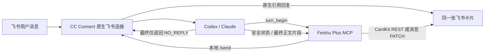

# CC Connect Feishu Plus

在不修改官方 CC Connect 源码和二进制、也不新建第二条飞书事件连接的前提下，为 CC Connect 增加更完整的飞书单卡片交互。

> 当前版本：`0.1.1` MVP。npm Registry 包名已预留设计但尚未发布；当前发行版可直接通过 npm 从 GitHub 安装。

## MVP 做了什么

- 一次 Agent 回合只维护一张结构化 Card 2.0 卡片。
- 占位卡片仍由 CC Connect 原生飞书适配器发送，因此保留 `reply_to_trigger` 的原消息引用关系。
- 长任务先显示安全、粗粒度的“理解 / 处理 / 核对 / 整理”状态。
- 长回答可通过 `turn_write` 按最终正文片段持续追加；短回答可直接进入打字机动画。
- CardKit 权限可用时使用原生文本增量接口；不可用时自动退化为同一消息的整卡 PATCH。
- 完成后显示干净、明确的 `✅ Done`，不再显示模型、token、上下文和工作目录尾巴。
- 思考过程、Bash、工具名、工具参数和中间结果不会进入卡片。
- 插件不可用或当前不是飞书会话时，保留 CC Connect 原生回复作为后备。

## 宿主边界

这个项目是 companion plugin，不是 CC Connect 的 fork，也不替代它：

- 不修改、注入或替换 `cc-connect` 官方二进制。
- 不修改官方源码仓库。
- 不接管飞书入站事件，不创建 WebSocket 长连接。
- 不替换原生飞书适配器、会话路由、权限过滤或升级渠道。
- 只使用 CC Connect 已有的 `CC_PROJECT` / `CC_SESSION_KEY` 上下文、本地 `/send` API、Agent MCP 配置和用户配置项。
- 安装前后记录并比对官方二进制 SHA-256；自动化测试也覆盖了“不写宿主二进制”。

安装器会修改用户自己的 `~/.cc-connect/config.toml` 和 Codex/Claude MCP 配置，这是启用插件所需的受支持配置，不是对 CC Connect 程序本身打补丁。原配置会以 `0600` 权限逐字节备份。



## 安装

前置条件：

- CC Connect `1.4.1` 或更高版本，且原生飞书机器人已经能正常收发消息。
- Node.js 20 或更高版本。
- 项目 Agent 为 Codex 或 Claude Code。
- `feishu_plus` 这个 MCP 名称尚未被其他配置占用。

先做完全只读的 dry-run：

```bash
npm exec --yes \
  --package=github:timmyagentic/cc-connect-feishu-plus#v0.1.1 \
  -- cc-connect-feishu-plus install --dry-run
```

确认项目与官方二进制身份后安装：

```bash
npm exec --yes \
  --package=github:timmyagentic/cc-connect-feishu-plus#v0.1.1 \
  -- cc-connect-feishu-plus install
```

只为指定项目启用时，可重复传入 `--project`：

```bash
npm exec --yes \
  --package=github:timmyagentic/cc-connect-feishu-plus#v0.1.1 \
  -- cc-connect-feishu-plus install --project my-project
```

安装器不会自动重启 CC Connect。让 CC Connect 重新加载配置后，新建一个 Agent 会话即可使用；既有长驻 Agent 进程不会被强制终止。

npm Registry 正式发布后，等价命令会缩短为：

```bash
npx --yes cc-connect-feishu-plus@0.1.1 install
```

## 飞书权限

插件在发送占位卡片前会先只读检查“获取会话历史消息”能力。缺少权限时不会留下卡住的占位卡片，而是让 CC Connect 继续原生回复。

飞书应用需要能调用：

- [获取会话历史消息](https://open.feishu.cn/document/server-docs/im-v1/message/list)
- [更新应用发送的消息卡片](https://open.feishu.cn/document/uAjLw4CM/ukTMukTMukTM/reference/im-v1/message/patch)

以下 CardKit 能力用于更丝滑的原生打字机效果；权限不足会自动降级为整卡 PATCH：

- [消息 ID 转卡片 ID](https://open.feishu.cn/document/uAjLw4CM/ukTMukTMukTM/cardkit-v1/card/id_convert)
- [全量更新卡片](https://open.feishu.cn/document/cardkit-v1/card/update)
- [流式更新卡片文本](https://open.feishu.cn/document/cardkit-v1/streaming-updates-openapi-overview)

请在飞书开放平台按对应 API 的权限提示为应用开通权限，并发布应用版本使权限生效。

## 运行机制

1. Agent 每回合先调用 `turn_begin`。
2. 插件读取 CC Connect 继承下来的项目与会话上下文，并确认这是 Feishu/Lark 会话。
3. 插件先做只读历史消息权限检查；通过后才调用 CC Connect 本地 `/send`。
4. CC Connect 使用原生飞书适配器发出带隐藏唯一标记的占位卡片，因此引用原始提问。
5. 插件通过历史消息 API 找回这条卡片的 `message_id`。
6. 能取得 `card_id` 时使用 CardKit；否则使用 `message_id` PATCH，同一消息不会被替换成另一条回复。
7. Agent 可用 `turn_activity` 更新安全阶段，用 `turn_write` 追加最终正文片段。
8. `turn_complete` 写入完整答案并切换为 `✅ Done`；Agent 最终只向 CC Connect 返回 `NO_REPLY`，避免第二条原生答案。

MCP 工具协议：

- `turn_begin()`：建立本回合卡片；必须最先调用。
- `turn_activity(phase)`：仅允许预定义的粗粒度阶段。
- `turn_write(markdown_delta)`：只追加已经可以面向用户展示的最终正文片段。
- `turn_complete(markdown)`：以完整 Markdown 收口并显示 Done。
- `turn_fail(message)`：用简洁的用户可见说明结束失败回合。

## 安装器具体改动

对选中的 Feishu 项目，安装器采用幂等、可回滚的配置变换：

- 追加带版本标记的 `append_system_prompt`，保留用户已有 prompt。
- 设置项目级 `[projects.display]` 为 `quiet`，关闭思考、工具和状态尾巴；保留用户原有 `card_mode`，让原生 Rich Card 仍可作为后备。
- 将 `feishu` / `lark` 加入全局流式预览禁用列表，防止官方预览再创建第二张卡。
- 通过官方 `codex mcp add` / `claude mcp add` 命令注册 `feishu_plus`。
- 在 `~/.cc-connect/feishu-plus/` 保存权限为 `0600` 的备份、安装清单和短生命周期回合状态。

插件不会持久化 `app_secret` 或 tenant token；token 只保存在 MCP 进程内存中。回合状态文件不包含思考或工具调用，只包含卡片定位信息和已经面向用户展示的正文草稿。

## 检查与卸载

```bash
npm exec --yes \
  --package=github:timmyagentic/cc-connect-feishu-plus#v0.1.1 \
  -- cc-connect-feishu-plus doctor
```

`doctor` 会检查配置、原生 Unix socket、安装清单和官方二进制哈希，并明确报告单连接边界。

卸载：

```bash
npm exec --yes \
  --package=github:timmyagentic/cc-connect-feishu-plus#v0.1.1 \
  -- cc-connect-feishu-plus uninstall
```

如果安装后用户又改过 CC Connect 配置，卸载器会拒绝覆盖这些改动，而不是贸然恢复旧文件。此时先运行 `doctor` 并人工合并配置。

## 当前限制

- `turn_write` 是合作式协议：Agent 需要遵守注入的系统提示。若 Agent 未调用插件工具，CC Connect 原生回复仍是最终后备。
- 插件不能改变 CC Connect 的入站白名单、群聊触发规则、线程隔离或消息解析；这些继续完全由原生适配器负责。
- 单卡片正文上限当前为 24,000 个 Unicode 字符；超长回答会失败关闭，避免生成不可更新的飞书卡片。
- CardKit 的 `id_convert` 接口已被飞书标为废弃但仍可用，因此整卡 PATCH 是长期保留的兼容路径。

## 开发

```bash
npm install
npm run check
npm test
npm pack --dry-run
```

只读验证本机已保存飞书会话是否具有历史消息访问能力：

```bash
npm run build
node scripts/verify-live-readonly.mjs ~/.cc-connect/config.toml
```

历史上的完整分发版实验保存在 [cc-connect-feishu-plus-legacy-fork](https://github.com/timmyagentic/cc-connect-feishu-plus-legacy-fork)，不会被本项目作为运行时使用。

## License

MIT
